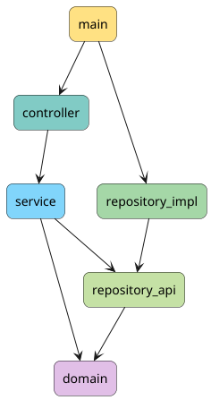

# Java CLI application clean architecture archetype

This Maven archetype generates a **thin, opinionated project structure**
based on **Clean Architecture principles**.\
It provides a minimal, production-ready modular layout that separates
concerns and enforces dependency direction from the start.




The archetype intentionally contains **only structural dependencies and
JUnit 5 for testing**, allowing teams to build their own technology
stack on top.

## Overview

The generated project follows **Clean Architecture** with strict module
boundaries and dependency rules.

Key goals:

-   Clear separation of concerns
-   Dependency inversion enforced by modules
-   Framework-agnostic domain layer
-   Minimal ("thin") starting point
-   Easy extensibility
-   Testability by design

This archetype **does not impose frameworks** (Spring, Quarkus, etc.).\
It provides architecture --- not implementation decisions.

## Usage

To generate a project with following properties
```xml
  <groupId>com.example</groupId>
  <artifactId>calculator</artifactId>
  <version>1.0-SNAPSHOT</version>

```
use the following command line:

```
mvn archetype:generate \
-DarchetypeGroupId=pl.fistach \
-DarchetypeArtifactId=java-cli-clean-architecture-archetype \
-DgroupId=com.example \
-DartifactId=calculator \
-Dversion=1.0-SNAPSHOT \
-Dpackage=com.calculator \
-DinteractiveMode=false
```

After generating the project, check the README.md files
in each module for more information.

## Testing

The archetype includes **JUnit 5** as the default testing framework.

Recommended testing strategy is the test-driven development, 
with tests written test for each module as a whole,
in the following order:

* domain           
* service          
* controller       
* repository-impl  
